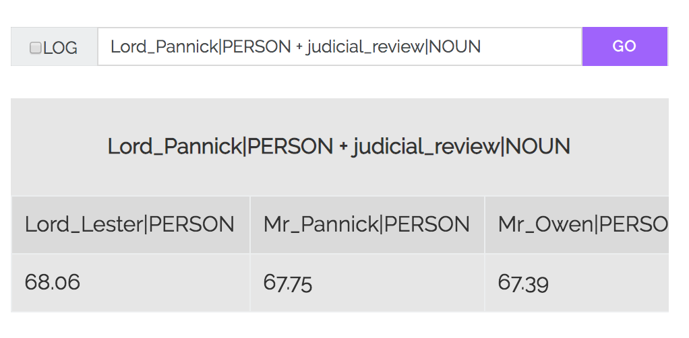

# Case2Vec

A simple web application for searching Word2Vec embeddings derived from approximately 2,000 law reports published by The Incorporated Council of Law Reporting for England & Wales (https://www.iclr.co.uk).

## The data

This experiment used a comparatively small training corpus composed of a collection of sentences extracted from about 2,000 law reports published by ICLR. 

## The training process

1. Extract sentences from the original reports using spaCy's sentence segmenter and write to disk in a text file with a sentence on each line.
2. Process that file using https://github.com/explosion/sense2vec/blob/master/bin/preprocess.py to build a vocabularly with Part-of-Speech and Named Entity tags appended to each token. This stage yielded the following output for each sentence in the corpus:
Sample sentence following preprocessing:

```The|DET claimant|NOUN further|ADV alleges|VERB that|ADP the|DET journals|NOUN are|VERB original_literary_works|NOUN within|ADP the|DET meaning|NOUN of|ADP the|DET Copyright|PROPN Designs|PROPN and|CCONJ Patents|PROPN Act|PROPN that|DET copyright|NOUN in|ADP them|PRON belongs|VERB to|ADP himself|PRON as|ADP their|DET author|NOUN and|CCONJ that|ADP by|ADP reproducing|VERB extracts|NOUN from|ADP the|DET Hong_Kong_journal|NOUN in|ADP the|DET November_edition|NOUN and|CCONJ by|ADP copying|VERB and|CCONJ continuing|VERB in|ADP possession|NOUN of|ADP all|DET eight|CARDINAL journals|NOUN in|ADP the|DET course|NOUN of|ADP its|DET business|NOUN knowing|VERB or|CCONJ having|VERB reason|NOUN to|PART believe|VERB that|ADP they|PRON are|VERB infringing|VERB copies|NOUN of|ADP copyright|NOUN works|VERB the|DET defendant|NOUN has|VERB infringed|VERB his|DET copyright|NOUN in|ADP them|PRON```

3. This output was then fed into Gensim's Word2Vec implementation to generate the word embeddings.

# Credit and acknowledgment

The Tornado web application included in this repository is heavily based on https://github.com/superkerokero/word2vec-search-app. Only minor modifications were made to the original codebase, including minor changes to `server.py`, `index.html` and `ajaxclient.js`. As such, we are very grateful to https://github.com/superkerokero for making the code available. 

# Usage
## Create a new virtual environment
1. Create a new virtual environment.
```python3 -m venv env```
2. Activate the virtual environemtn.
```source env/bin/activate```
## Install dependencies
```pip3 install -r requirements.txt```
## Decompress the vector file
Decompress `common_sense_law_model_sm.txt.zip`
## Start the server
At the command line run `python server.py`

Once the vectors are loaded and the server is running the web application will listen on port `8000`.
## Go to the web application
Navigtion to `localhost:8000` in your web browser


# Searching the vectors
Rather than training the vectors on the tokens in the corpus, we first processed the corpus with
https://github.com/explosion/sense2vec/blob/master/bin/preprocess.py. This stage processed the corpus using spaCy's `en_core_web_lg` model which appended semantic identifiers to the tokens in the corpus. The advantage of this preprocessing step was that the raw word tokens were converted in place into more meaningful tokens to feed forward into the Word2Vec model.

For example,
* the tokens `judicial` and `review` were identified as a phrase and tagged as a `NOUN`
* the tokens `United` and `Kingdom` were recognised as a phrase and were tagged as geopolitical entity by the spaCy model.
* the tokens `Lord` and `Pannick` were recognised as a phrase and were tagged as a person.
```
judicial_review|NOUN
United_Kingdom|GPE
Lord_Pannick|PERSON
```

To search for the vectors that are most similar to `Lord_Pannick|PERSON`, submit `Lord_Pannick|PERSON` as a search. What's interesting here is the vectors reveal that Lord Pannick QC shares proximity in vector space with other barristers of similar standing.
 

You can also do very basic vector algebra searches, such as `Lord_Pannick|PERSON + judicial_review|NOUN`



