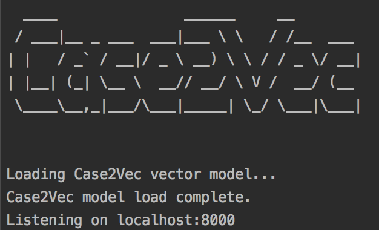
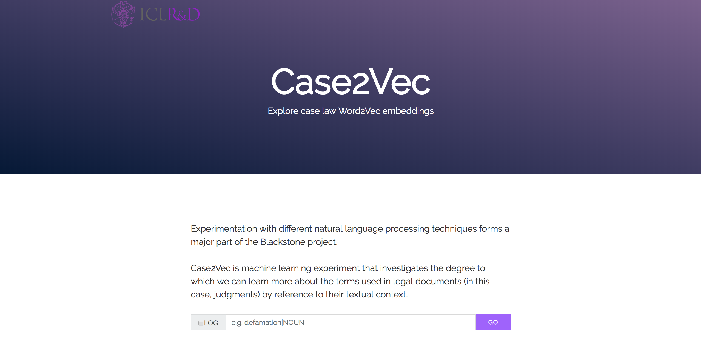
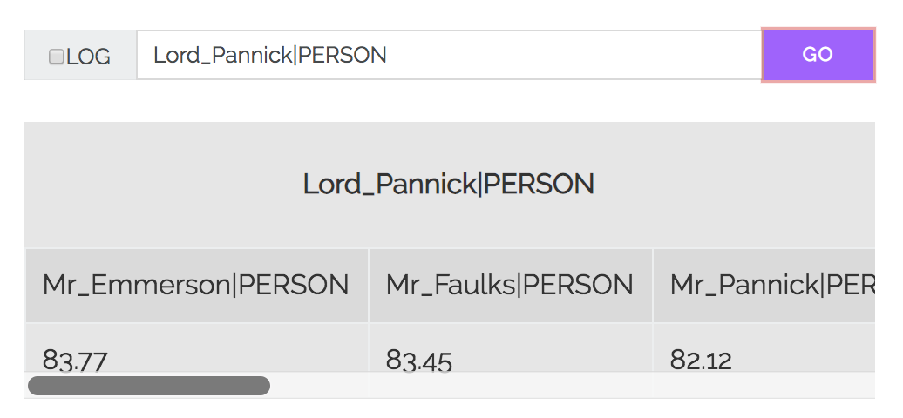

# Case2Vec

A simple web application for searching Word2Vec embeddings derived from approximately 2,000 law reports published by The Incorporated Council of Law Reporting for England & Wales (https://www.iclr.co.uk).

# Credit and acknowledgment

The Tornado web application included in this repository is heavily based on https://github.com/superkerokero/word2vec-search-app. Only minor modifications were made to the original codebase, including minor changes to `server.py`, `index.html` and `ajaxclient.js`. As such, we are very grateful to https://github.com/superkerokero for making the code available. 

# Usage
## Create a new virtual environment
1. Create a new virtual environment.
```python3 -m venv env```
2. Activate the virtual environemtn.
```source env/bin/activate```
## Install dependencies
```pip3 install -r requirements.txt```
## Decompress the vector file
Decompress `common_sense_law_model_sm.txt.zip`
## Start the server
At the command line run `python server.py`

Once the vectors are loaded and the server is running the web application will listen on port `8000`.
## Go to the web application
Navigtion to `localhost:8000` in your web browser


# Searching the vectors
Rather than training the vectors on the tokens in the corpus, we first processed the corpus with
https://github.com/explosion/sense2vec/blob/master/bin/preprocess.py. This stage processed the corpus using spaCy's `en_core_web_lg` model which appended semantic identifiers to the tokens in the corpus. The advantage of this preprocessing step was that the raw word tokens were converted into more meaningful tokens to feed forward into the Word2Vec model.

For example,
* the tokens `judicial` and `review` were identified as a phrase and tagged as a `NOUN`
* the tokens `United` and `Kingdom` were recognised as a phrase and were tagged as geopolitical entity by the spaCy model.
* the tokens `Lord` and `Pannick` were recognised as a phrase and were tagged as a person.
```
judicial_review|NOUN
United_Kingdom|GPE
Lord_Pannick|PERSON
```

To search for the vectors that are most similar to `Lord_Pannick|PERSON`, submit `Lord_Pannick|PERSON` as a search.



